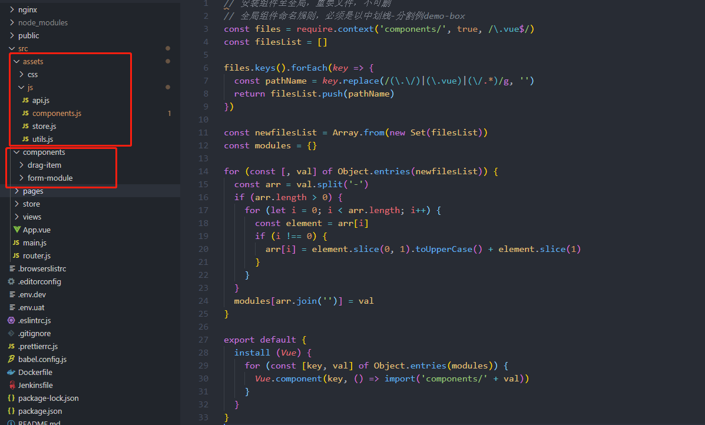

<!--
 * @Author: your name
 * @Date: 2021-02-03 16:51:11
 * @LastEditTime: 2021-02-03 18:21:10
 * @LastEditors: Please set LastEditors
 * @Description: In User Settings Edit
 * @FilePath: \mini-componentsd:\git-project\front-end-article\docs\04.md
-->

## 全局引入自定义模板

1、在 vue 项目的 /src/assets/js/commponents.js 中

```js
// 全局组件命名规则，必须是以中划线-分割例demo-box
//深度遍历获取components文件下的以.vue结尾的文件
const files = require.context("components/", true, /\.vue$/);
const filesList = [];
//files 的结果 /drag-item/index.vue
files.keys().forEach((key) => {
  //正则匹配
  const pathName = key.replace(/(\.\/)|(\.vue)|(\/.*)/g, "");
  return filesList.push(pathName);
  // filesList 的结果 ["drag-item"]
});

const newfilesList = Array.from(new Set(filesList));
const modules = {};

//将 filesList 每一项驼峰化
for (const [, val] of Object.entries(newfilesList)) {
  const arr = val.split("-");
  if (arr.length > 0) {
    for (let i = 0; i < arr.length; i++) {
      const element = arr[i];
      if (i !== 0) {
        arr[i] = element.slice(0, 1).toUpperCase() + element.slice(1);
      }
    }
  }
  modules[arr.join("")] = val;
}

export default {
  install(Vue) {
    for (const [key, val] of Object.entries(modules)) {
      Vue.component(key, () => import("components/" + val));
    }
  },
};
```



2、在/main.js 中引入并使用

```js
import VueModule from "assets/js/components.js";

Vue.use(VueModule);
```
